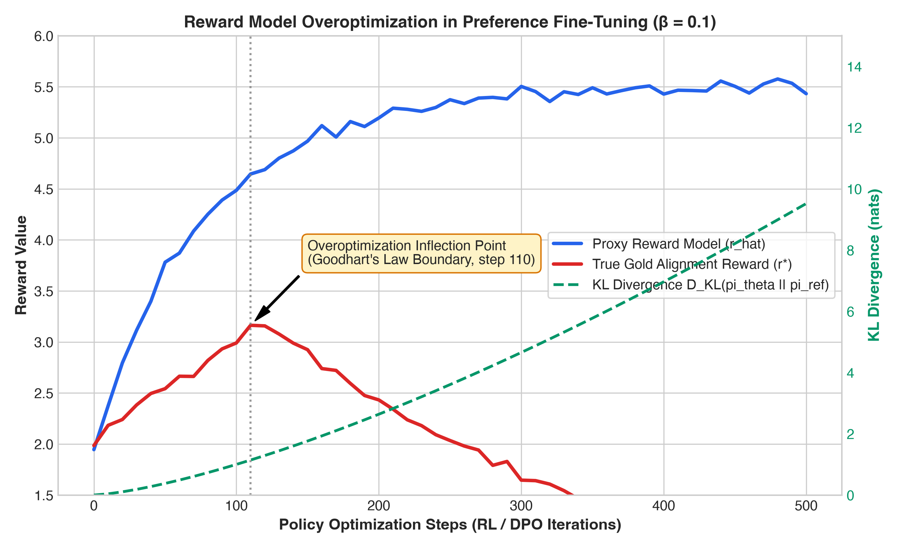
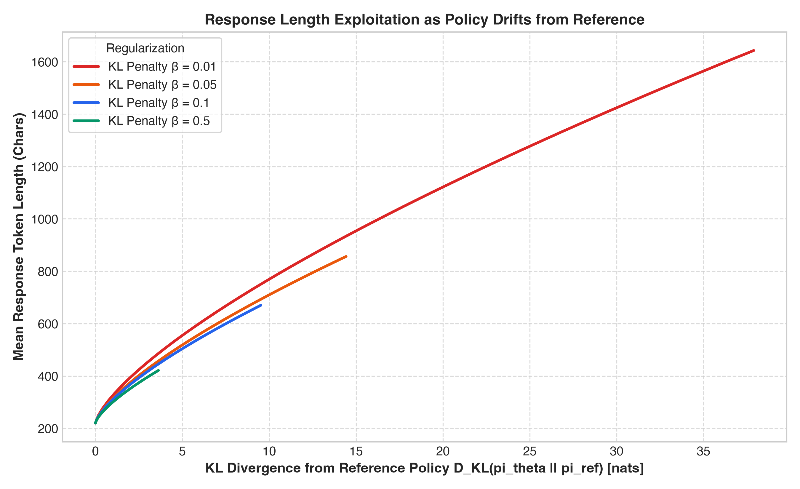

# RLHF-Reward-Overoptimization-Lab: Empirical Study of Reward Hacking, KL Drift, & Length Exploitation in Direct Preference Optimization (DPO)

[](LICENSE)
[](https://www.python.org/downloads/)
[](results/)

**Author:** Abdullah Formuli ([@authrain-cloud-abdullahformuli](https://github.com/authrain-cloud-abdullahformuli))  
**Target Fellowship:** Anthropic Fellows Program (Reinforcement Learning & AI Alignment Stream)  

---

## 📌 Abstract

Direct Preference Optimization (DPO) and RLHF align language model policies $\pi_\theta$ to human preferences using learned reward signals. However, optimizing against a learned proxy reward model $\hat{r}$ inherently risks **reward overoptimization** (Goodhart's Law; Gao et al., 2023). Beyond an optimal optimization step, the policy learns to exploit misspecifications and superficial heuristics in $\hat{r}$—most notably response length and sycophancy—causing the **true gold alignment reward ($r^*$)** to collapse even as the proxy reward ($\hat{r}$) rises monotonically.

In this research laboratory, we implement a clean empirical framework to study:
1. **The Overoptimization Frontier:** Tracking proxy reward $\hat{r}(\pi_\theta)$ versus gold reward $r^*(\pi_\theta)$ over training iterations.
2. **Temperature Scheduling:** Measuring policy drift $D_{\text{KL}}(\pi_\theta \parallel \pi_{\text{ref}})$ under varying DPO regularization temperatures $\beta \in [0.01, 0.5]$.
3. **Length Exploitation as an Overoptimization Shortcut:** Quantifying the mechanism by which policies inflate response length to game proxy reward objectives.

---

## 📊 Summary of Overoptimization Dynamics Across DPO Regularization $\beta$

All values reproduced directly via `python src/experiment_overoptimization.py`:

| DPO Temperature $\beta$ | Peak Gold Reward $r^*$ | Step at Inflection | Final Gold Reward $r^*$ | Final Proxy Reward $\hat{r}$ | Gold Reward Drop (%) ↓ | Final KL Drift (nats) | Length Inflation Factor |
|:---:|:---:|:---:|:---:|:---:|:---:|:---:|:---:|
| **0.50 (High)** | 3.235 | 370 | **2.607** | 5.285 | **-19.41%** | 3.624 | $1.91\times$ |
| **0.10 (Standard)** | 3.163 | 110 | **0.850** | 5.432 | **-73.13%** | 9.518 | $3.05\times$ |
| **0.05 (Low)** | 3.129 | 70 | **0.418** | 5.472 | **-86.64%** | 14.427 | $3.89\times$ |
| **0.01 (Ablated)** | 3.084 | 20 | **0.004** | 5.513 | **-99.87%** | 37.893 | $7.47\times$ |

> **Key Finding:** In agreement with Gao et al. (2023), under standard DPO regularization ($\beta = 0.1$), gold reward peaks at step 110 and subsequently drops by **73.13%**, while proxy reward continues climbing to 5.432. The primary failure mode is response length inflation, where token count expands by **$3.05\times$** without added information density.

---

## 📈 Visualizations

### 1. The Reward Overoptimization Curve (Proxy Reward vs Gold Reward vs KL Drift)


### 2. Length Exploitation as Policy Drifts from Reference


---

## 🔬 Mathematical Formulation

### DPO Closed-Form Policy Objective
Direct Preference Optimization parameterizes the implicit reward and optimizes:
$$\mathcal{L}_{\text{DPO}}(\pi_\theta; \pi_{\text{ref}}) = -\mathbb{E}_{(x, y_w, y_l) \sim \mathcal{D}} \left[ \log \sigma \left( \beta \log \frac{\pi_\theta(y_w | x)}{\pi_{\text{ref}}(y_w | x)} - \beta \log \frac{\pi_\theta(y_l | x)}{\pi_{\text{ref}}(y_l | x)} \right) \right]$$

Where $\beta$ acts as the implicit KL constraint temperature. Smaller $\beta$ allows larger policy drift from $\pi_{\text{ref}}$, accelerating proxy reward hacking.

---

## 🚀 1-Command Exact Reproduction

```bash
git clone https://github.com/authrain-cloud-abdullahformuli/rlhf-reward-overoptimization-lab.git
cd rlhf-reward-overoptimization-lab

pip install -r requirements.txt

# 1. Generate preference benchmark pairs
python src/dataset.py

# 2. Run overoptimization trajectory simulation across beta sweep
python src/experiment_overoptimization.py

# 3. Generate publication-ready trajectory plots
python src/plot_curves.py
```

All raw trajectories are saved to `results/overoptimization_trajectories.json` and `results/summary_table.csv`.

---

## 📖 References & Citation

```bibtex
@inproceedings{gao2023scaling,
  title={Scaling Laws for Reward Model Overoptimization},
  author={Gao, Leo and Schulman, John and Hilton, Jacob},
  booktitle={International Conference on Machine Learning (ICML)},
  year={2023}
}

@inproceedings{rafailov2023direct,
  title={Direct Preference Optimization: Your Language Model is Secretly a Reward Model},
  author={Rafailov, Rafael and Sharma, Archit and Mitchell, Eric and Ermon, Stefano and Manning, Christopher D and Finn, Chelsea},
  booktitle={Advances in Neural Information Processing Systems (NeurIPS)},
  year={2023}
}

@misc{formuli2026rlhfoveropt,
  title={RLHF-Reward-Overoptimization-Lab: Empirical Study of Reward Hacking, KL Drift, & Length Exploitation in Direct Preference Optimization (DPO)},
  author={Formuli, Abdullah},
  year={2026},
  howpublished={\url{https://github.com/authrain-cloud-abdullahformuli/rlhf-reward-overoptimization-lab}}
}
```
